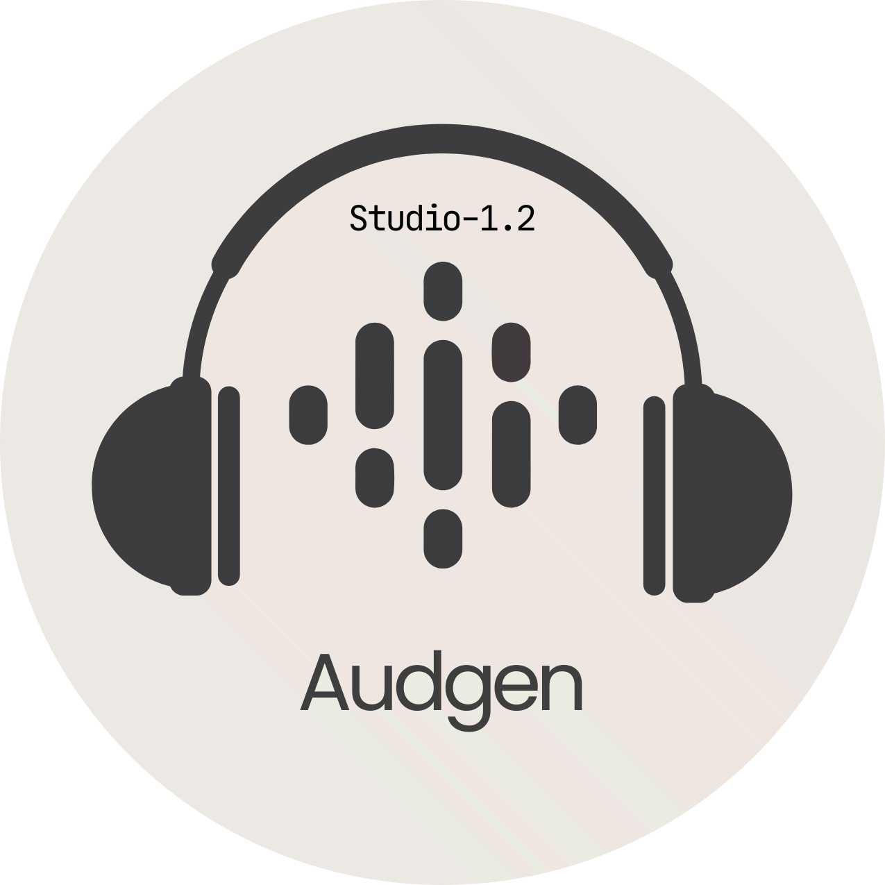

<div align="center">
  
  
  # Audgen Studio
  
  **Next-Generation Neural Audio Synthesis**
  
  <p>
    <a href="https://audgen.pages.dev">
      
    </a>
    
    
    
  </p>

  <h3>
    <a href="https://audgen.pages.dev">Live Demo</a>
    <span> | </span>
    <a href="request.html">Request API</a>
    <span> | </span>
    <a href="https://github.com/aurasqlm/audgen/issues">Report Bug</a>
  </h3>
</div>

---

## ⚡ Overview

**Audgen** is an ultra-lightweight, high-performance web application that transforms text into lifelike speech. Built with a focus on **UI/UX excellence** and **zero-latency processing**, Audgen bridges the gap between complex AI models and content creators.

Leveraging the power of the **AbhiBots API** (wrapping ElevenLabs v2), Audgen offers studio-quality voice generation, custom voice cloning, and granular control over stability and similarity—all within a futuristic, glassmorphism-inspired interface.

## 🚀 Key Features

* **🎙️ Ultra-Realistic Synthesis:** Access to top-tier voice models (Rachel, Adam, Antoni, Josh) with human-like intonation.
* **🎛️ Studio Controls:** Fine-tune audio output with precision sliders for **Stability** and **Similarity Boost**.
* **🆔 Custom Voice Cloning:** Bring your own ElevenLabs Voice ID to generate audio with specific custom voices.
* **⚡ Instant Export:** Generate and download MP3s in seconds.
* **🎨 Neo-Glass UI:** A fully responsive, dark-mode interface featuring dynamic ambient glows, smooth cubic-bezier animations, and blurred surfaces.
* **🎵 Integrated Player:** Custom-built audio player with waveform visualization and scrubbing.
* **📱 Mobile Optimized:** Full feature parity on mobile devices with a custom off-canvas navigation system.

## 🛠️ Tech Stack

<div align="center">

| Frontend | Styling | Logic | API Integration | Hosting |
| :---: | :---: | :---: | :---: | :---: |
| **HTML5** | **CSS3** (Variables & Animations) | **Vanilla JavaScript** (ES6+) | **Fetch API / Async-Await** | **Cloudflare Pages** |

</div>

## 📸 Interface Preview

> *Imagine a sleek, dark interface with indigo glowing orbs and a glass-panel control deck.*

### The Studio (`voice.html`)
The core workspace where magic happens. Users can input text (up to 5000 chars), select models, and visualize generation status in real-time.

### The Landing (`index.html`)
A high-conversion landing page featuring scroll-triggered animations (Intersection Observer) and a glowing "GEN-A" watermark.

## 🔧 Installation & Setup

Audgen is a client-side application. You can run it locally with any static server.

1.  **Clone the repository**
    ```bash
    git clone [https://github.com/aurasqlm/audgen.git](https://github.com/aurasqlm/audgen.git)
    cd audgen
    ```

2.  **Add Assets**
    Ensure your `assets/` folder contains:
    * `logo.png`
    * `cropped-logo.png`
    * `watermark.png`
    * `Tutorial-Desktop.mp4`

3.  **Run Locally**
    If you have Python installed:
    ```bash
    python -m http.server 8000
    ```
    Or using VS Code Live Server extension.

4.  **API Configuration**
    The API logic is located in `voice.html`.
    ```javascript
    // Currently configured to use AbhiBots proxy
    const API_URL = '[https://abhibots.com/api/tts/generate](https://abhibots.com/api/tts/generate)';
    ```

## 📖 Usage Guide

1.  **Select a Voice:** Choose from the dropdown or select "Enter Custom Voice ID" to paste a specific ElevenLabs ID.
2.  **Adjust Settings:**
    * *Stability:* Higher values make the voice more consistent but monotone. Lower values are more expressive.
    * *Similarity:* Controls how closely the AI mimics the original voice sample.
3.  **Input Text:** Type or paste your script into the editor.
4.  **Generate:** Click the glowing "Generate Audio" button.
5.  **Download:** Use the menu on the player to save your `.mp3` file.

## 🤝 Contributing

Contributions are what make the open-source community such an amazing place to learn, inspire, and create. Any contributions you make are **greatly appreciated**.

1.  Fork the Project
2.  Create your Feature Branch (`git checkout -b feature/AmazingFeature`)
3.  Commit your Changes (`git commit -m 'Add some AmazingFeature'`)
4.  Push to the Branch (`git push origin feature/AmazingFeature`)
5.  Open a Pull Request

## ⚠️ Terms & Policy

* **Fair Use:** This tool utilizes the AbhiBots API. High-volume usage is rate-limited.
* **Content Policy:** Generation of illegal, hateful, or deepfake-impersonation content is strictly prohibited.
* **Privacy:** Text inputs are processed ephemerally and not stored.

## 🌟 Credits & Acknowledgements

* **Lead Developer:** [aurasqlm](https://nexa.unaux.com)
* **API Provider:** [AbhiBots](https://abhibots.com)
* **Core Engine:** ElevenLabs
* **Design System:** Powered by **GEN-A**

---

<div align="center">

**[Get Support](mailto:sayan@sajidsayan.work.gd)** • **[Docs](info.html)**

<p>© 2026 Audgen Platform. Made with 💜 and ☕.</p>

</div>
